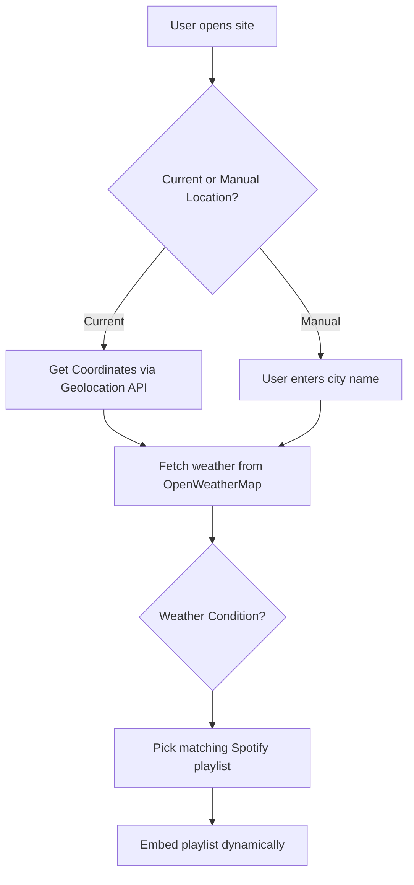

# 🎵 ATMOTUNE 🌦️  
**Vibe to the Rhythm of the Weather**  


> “Turn your mood into music powered by the sky.”

ATMOTUNE is a **vibe-based music recommendation web app** that takes live weather data from your location—or any city you type—and pairs it with the perfect Spotify playlist. 🎧💫

---

## 🚀 [Live Demo](#)
> Replace the # above with your GitHub Pages or hosting link

---

## 🧠 What is ATMOTUNE?

🎯 It detects the weather outside your window and reflects it in your music. From rainy-day blues to sunny road-trip beats — we've got a playlist ready.

🎛️ You can either:
- Use **Auto Mode** (via Geolocation API)
- Or **Manual Mode** to enter any city 🌍

---

## 🖼️ Sneak Peek

| Auto Location Mode | Manual Location Mode |
|---------------------|----------------------|
|  |  |

> *(Add real screenshots once you host it)*

---

## 🔥 Features

- 🌦️ Auto-detect your current weather
- 🔎 Search and explore weather of any city
- 🎵 Dynamic Spotify playlists for each weather type
- 📱 Fully responsive and animated UI with emojis 🌈
- 🌍 No signup/login required

---

## 🧰 Tech Stack

| Tech | Description |
|------|-------------|
| `HTML` | Page structure |
| `CSS`  | Responsive & animated styling |
| `JavaScript` | Logic to connect weather with music |
| `OpenWeatherMap API` | Live weather data |
| `Spotify Embed` | Vibe-rich playlists |

---

## 🧩 How It Works



---

## 🛠️ Installation Guide

Want to build your own version? Follow these steps! 👇

### 1. Clone the Repository
```bash
git clone https://github.com/your-username/atmotune.git
cd atmotune
```

### 2. Open `index.html`
Just double-click or open in your browser.

### 3. Replace the API Key
In `script.js`, change:
```js
const apiKey = 'YOUR_OWN_API_KEY';
```
Get yours from [OpenWeatherMap](https://openweathermap.org/api)

### 4. Customize Playlists (Optional)
You can edit the playlist URLs in `script.js` to add your personal music taste!

---

## 🗂️ Folder Structure

```
📦 ATMOTUNE
 ┣ 📜 index.html        # Main Page (Auto Location)
 ┣ 📜 main.html         # Manual Location Page
 ┣ 📜 style.css         # Styling
 ┣ 📜 script.js         # Weather & Music Logic
```

---

## 🌦️ Weather-to-Playlist Magic

| Weather | Playlist Vibe |
|--------|----------------|
| ☀️ Clear | Chill sunny tunes |
| 🌧️ Rain | Rainy day melodies |
| 🌩️ Thunderstorm | Intense beats |
| ❄️ Snow | Calm winter vibes |
| ☁️ Clouds | Lo-Fi cloudy moods |
| 🌫️ Mist | Ambient reflections |

(*Uses embedded Spotify iframes*)

---

## 💡 Want to Add More?

Try these ideas:
- 🌙 Change background based on time of day
- 🧠 AI-generated playlist titles
- 🛜 PWA Support for offline mode
- 📱 Mobile App version with Flutter or React Native

---

## 👩‍💻 Author

**Likhitha HS** 😺  
*Made with love, code, and weather*

---

## 🪪 License

MIT License – use, share, remix with credit 💖

---

## ⭐ If You Like It...

Drop a star ⭐ on [GitHub](https://github.com/your-username/atmotune)  
Share it with your friends & let them vibe too 💫
